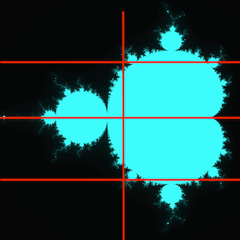
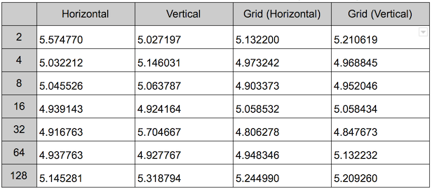

# Imagex

This library enables for fractals to have their workload sliced into different
orientations, where each chunk is run in a separate process. See the
[About](about) section for information on what it can do.

Whilst the functionality is basically complete, there's still a lot more work
that needs to be done, including:
 - Testing
 - Documentation
 - Code cleanup
 - More examples with better information
 - ...

Exposed APIs will most likely change, so do not rely on it yet...


## Installation

Fetch the code from this repo - installation via Hex is not available yet...


## About

This library schedules processes to run each chunk a fractal has been divided
into. It enables for the following slicing modes:

`:horizontal` slicing:


`:vertical` slicing:


`{:grid, :horizontal}` slicing:



`{:grid, :vertical}` slicing:


## Usage

Here's a simple script that runs the mandelbrot algorithm (from my Exmbrot
library, to be released) on 2, 4, 8, 16, 32, 64, and 128 processes for all slicing modes:
```elixir
1..7
|> Enum.map(&(round(:math.pow(2, &1))))
|> Enum.map(fn chunks ->
    imagex_processor = struct(Imagex.Processor, [chunks: chunks,
      slice_mode: {:horizontal},
      image_width: 2048,
      image_height: 2048,
      cutoff: 100])

    {time1, _} = :timer.tc(Imagex.Processor, :run, [imagex_processor, Exmbrot, :task])
    {time2, _} = :timer.tc(Imagex.Processor, :run, [%{imagex_processor | slice_mode: {:vertical}}, Exmbrot, :task])
    {time3, _} = :timer.tc(Imagex.Processor, :run, [%{imagex_processor | slice_mode: {:grid, :horizontal}}, Exmbrot, :task])
    {time4, _} = :timer.tc(Imagex.Processor, :run, [%{imagex_processor | slice_mode: {:grid, :vertical}}, Exmbrot, :task])

    IO.puts "#{time1}\t#{time2}\t#{time3}\t#{time4}"
  end)
```

Formatted output of run times (with process count down the left and slicing mode
along the top):


